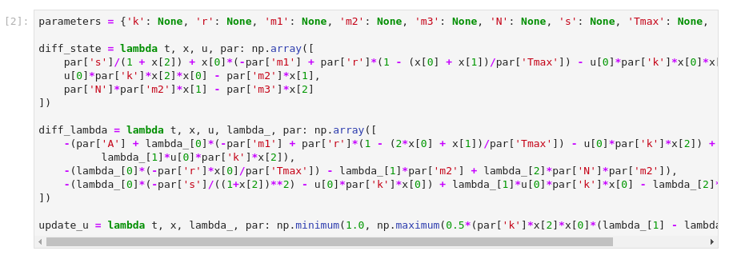
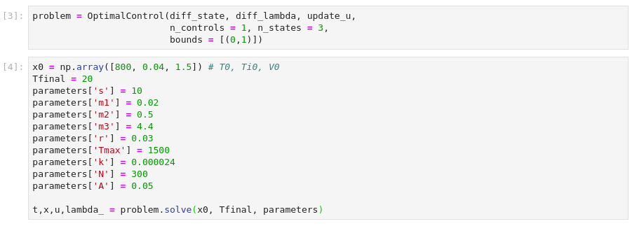

  <!-- [![Contributors][contributors-shield]][contributors-url]
[![Forks][forks-shield]][forks-url]
[![Stargazers][stars-shield]][stars-url]
[![Issues][issues-shield]][issues-url]
[![MIT License][license-shield]][license-url]
[![LinkedIn][linkedin-shield]][linkedin-url] -->

  <!--  -->

  <h1 align="center">Optimal Control Theory</h1>

  

    Repository containing the work developed for my scientific initiation on the topic.
      
    Advisor: <a href="https://emap.fgv.br/corpo-docente/maria-soledad-aronna"> Maria Soledad Aronna</a>
    <!--  
    <a href="https://github.com/othneildrew/Best-README-Template"><strong>Explore the docs »</strong></a>
    -->
  
 

<!--

  
Table of Contents

  <ol>
    <li>
      <a href="#about-the-project">About The Project</a>
      <ul>
        <li><a href="#built-with">Built With</a></li>
      </ul>
    </li>
    <li>
      <a href="#getting-started">Getting Started</a>
      <ul>
        <li><a href="#prerequisites">Prerequisites</a></li>
        <li><a href="#installation">Installation</a></li>
      </ul>
    </li>
    <li><a href="#usage">Usage</a></li>
  </ol>

-->

## About The Project

The objective of this project is to introduce the basic concepts of Optimum
Control: existence of solution, Pontryagin Maximum Principle and Dynamic 
Programming Principle. We intend to study different formulations of a control problem, 
examples of problems in real life, specially with biologic applications, and
basic theoretical results. The main reference of the the project was the book written by Suzanne Lenhart and John T. Workman called
[Optimal Control Applied to Biological
Models](https://www.routledge.com/Optimal-Control-Applied-to-Biological-Models/Lenhart-Workman/p/book/9781584886402#:~:text=Optimal%20Control%20Applied%20to%20Biological%20Models%20thoroughly%20develops%20the%20mathematical,this%20theory%20to%20biological%20models.&text=In%20addition%2C%20the%20authors%20introduce,partial%20differential%20equations%20(PDEs).).

Notes were produced on the subject in book form written in portuguese language, in order to serve as a reference in this language to start the studies in this topic. 

[[Download the book here]](https://github.com/lucasmoschen/Optimal_Control_Biological/blob/master/notes/book.pdf)

It was also developed in notebooks all the laboratories studied in these notes. For these simulation, *Python Programming Language* associated with *Jupyter Notebook* was used, because of its easy usage and simple interpretation. A class in `optimal_control_class.py` file was designed to deal with all laboratories, no need to worry with the code, initially. This code contains the famous method in the area called forward-backward sweep.

### Built With

One will need these frameworks to use see the project. 

* [Latex](https://en.wikipedia.org/wiki/LaTeX)
* [Python >= 3](https://www.python.org/)
* [Jupyter Notebook](https://jupyter.org/) 

### Python Packages 

* [Scipy](https://www.scipy.org/)
* [Sympy](https://www.sympy.org/en/index.html)
* [Numpy](https://numpy.org/) 
  
## Usage

### Notebooks 

After having the frameworks and python packages, it's necessary to open `jupyter lab` or `jupyter notebook`. In the `notebooks` folder, one can look at the Laboratories. Each laboratory is self contained, if the theory is well kwown. The first notebook explains the algorithm forward-backward sweep. 

- Laboratoty 1: Introductory example; 
- Laboratory 2: Mold and fungicide;
- Laboratory 3: Bacteria; 
- Laboratory 4: Limited case; 
- Laboratory 5: Cancer and treatment; 
- Laboratory 6: Fish harvesting; 
- Laboratory 7: Epidemy model; 
- Laboratory 8: HIV treatment; 
- Laboratory 9: Bear population; 
- Laboratory 10: Glucose model; 
- Laboratory 11: Timber harvesting; 
- Laboratory 12: Bioreactor; 
- Laboratory 13: Predator-Prey model. 

After opening each notebook, it's easy to follow the guide. 

### Python class

If one have a optimal control problem, it can be used the Python class developed for your case. This function can handle problems with: 

- Initial conditions of the states (obliged); 
- A characterization of the control in order to update it each iteration, that is, write $$u = f(t, x, \lambda)$$ (obliged); 
- Linear payoff terms (optional); 
- Bounds in the control (optional); 
- One or several states.

After one calculate the Hamiltonian and the necessary conditions, it's necessary: 

- Differential equations for the states (if more than one state or control, the fucntions must return an object `numpy.array`); 
- Differential equations for the adjoint functions; 
- A characterization of the control: it can handle simple Bang-Bang problems (chapter 11) and problems with bounds; 
- Number of states and controls (optional); 

For example, in the Laboratory 8, we first define these variables 

Because we have more than one state, we specify `n_states = 3`. We also specify the bounds. The bounds must be specified as a list of tuples for each control and `numpy.inf` is a possibility. However, the control's characterization must be written including the bounds as specified in the example. If one have a linear payoff term, it can be specified as a function: 

`diff_phi = lambda x, params: np.array([C, D, E])`. 

Observe that the parameters must be passed as a dictionary, including in the functions. At last, we define the final time and initial condition and use it in the `solve` method. 

If one has a Bang-Bang problem, the characterization of u is given by 

`u = lambda t, x, lambda, params: a if psi(t) < 0 else b` 

Suppose we have a nonlinear payoff term or we define a final value for some state, in these cases, we do not have the final value for the adjoint corresponding to the state with that additional condition. In this case, the adapted forward-backward sweep must be used. It's not developed for so, but can be used in the following manner: one define the list `free_adj_final` with the adjoints with that characteristic. Associated with that, one make a guess passing it in `theta_list` parameter. For more details, consult the notebook 

`Chapter21-examples.ipynb`. 

## Contributing

Any contributions and suggestions you make are **greatly appreciated**.

1. Fork the Project
2. Create your Feature Branch (`git checkout -b feature/AmazingFeature`)
3. Commit your Changes (`git commit -m 'Add some AmazingFeature'`)
4. Push to the Branch (`git push origin feature/AmazingFeature`)
5. Open a Pull Request

## License

Distributed under the MIT License. See `LICENSE` for more information.

## Contact

Lucas Moschen - lucas.moschen@fgv.edu.br

Project Link: [https://github.com/lucasmoschen/Optimal_Control_Biological](https://github.com/lucasmoschen/Optimal_Control_Biological)

## Acknowledgements

* [Fundação Getulio Vargas (FGV)]()
* [School of Applied Mathematics (EMAp)]()
* [Conselho Nacional de Desenvolvimento Científico e Tecnológico (CNPq)](https://www.gov.br/cnpq/pt-br)
* [Coordenação de Aperfeiçoamento de Pessoal de Nível Superior (CAPES)](https://www.gov.br/capes/pt-br)

